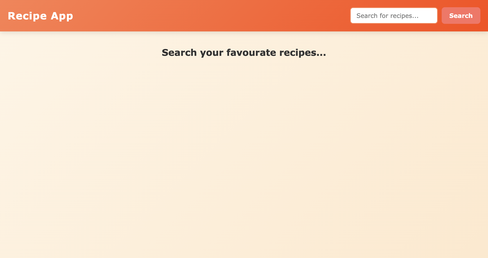
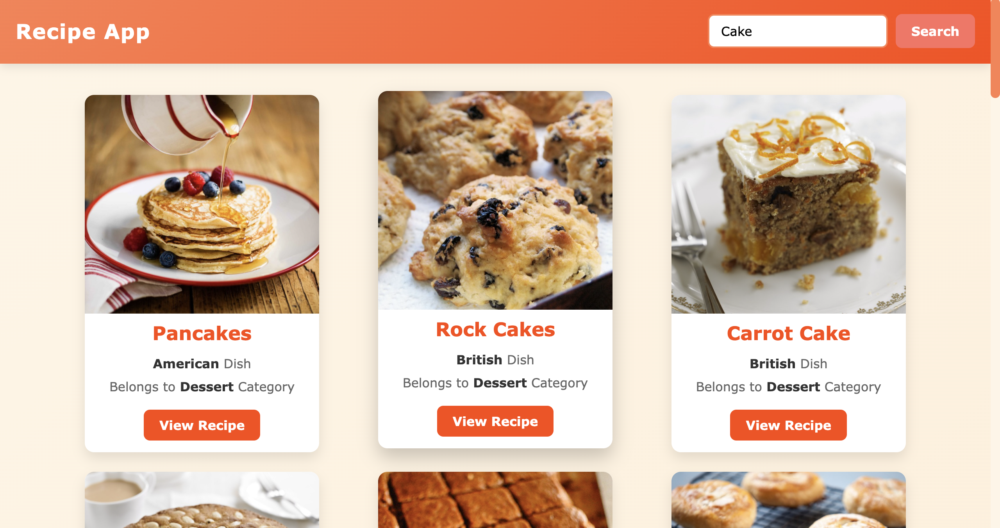
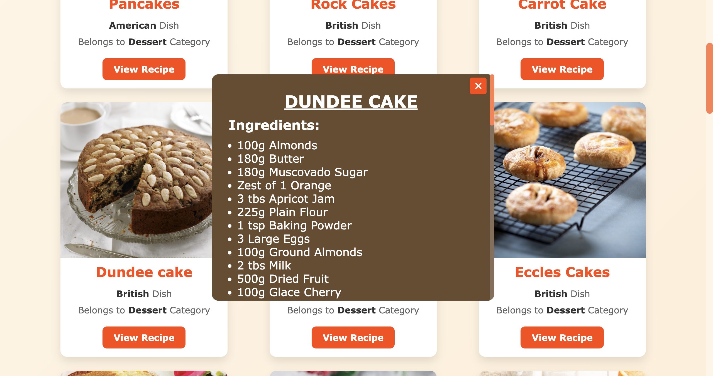
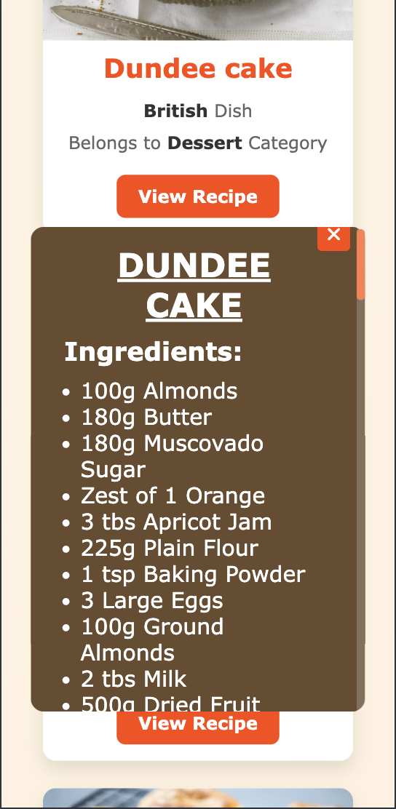

# Recipe App

The **Recipe App** is a web-based application that allows users to search for recipes by meal name. It fetches data from the [TheMealDB API](https://www.themealdb.com/) and displays detailed information about recipes, including ingredients, instructions, and meal categories. The app provides an interactive and user-friendly interface for food enthusiasts to explore and learn new recipes.

## 🌐 Live Demo

You can view the live demo of the Recipe App [here](#).

## 📸 Screenshot

**1.Home Page** 

   

**2.Search Results**  
<<<<<<< HEAD
<<<<<<< HEAD
=======
>>>>>>> origin/main

   

**3.Recipe Details Popup**  

   

<<<<<<< HEAD
=======

   

**3.Recipe Details Popup**  

   

**3.Responsive Design**  

   
>>>>>>> f4cf81c (Updated README file)
=======
**3.Responsive Design**  

   
>>>>>>> origin/main

## 🌟 Features

- **Search Recipes**:  
  Users can search for recipes by entering a meal name in the search box.

- **Dynamic Recipe Display**:  
  Recipes are dynamically fetched from the [TheMealDB API](https://www.themealdb.com/) and displayed in a grid layout.

- **Detailed Recipe View**:  
  Clicking on a recipe opens a popup with detailed information, including ingredients and cooking instructions.

- **Responsive Design**:  
  The app is fully responsive and works seamlessly on desktop and mobile devices.

- **Interactive UI**:  
  Smooth animations and hover effects enhance the user experience.

## 📖 How It Works

1. **Search Functionality**:  
   - Users enter a meal name in the search box and click the search button.  
   - The app fetches recipes from the [TheMealDB API](https://www.themealdb.com/) and displays them in a grid layout.

2. **Recipe Details Popup**:  
   - Clicking the "View Recipe" button on a recipe card opens a popup with detailed information.  
   - The popup includes the recipe name, ingredients, and step-by-step cooking instructions.

3. **Close Popup**:  
   - Users can close the recipe details popup by clicking the close button.

## 🛠️ Technologies Used

- **HTML5**: For structuring the web page.
- **CSS3**: For styling and creating a responsive design.
- **JavaScript (ES6)**: For interactivity and API integration.
- **TheMealDB API**: For fetching recipe data.

## 📂 Project Structure
Recipe-App/ ├── index.html # Main HTML file for the application ├── style.css # CSS file for styling the app ├── script1.js # JavaScript file for functionality ├── assets/ # Folder containing images and other assets └── readme.md # Project documentation

## 🚀 How to Run the Project

**1. Clone the Repository:**
   git clone https://github.com/your-username/recipe-app.git
**2. Navigate to the Project Directory:**
    cd recipe-app
**3. Open the Application:**
    Open the index.html file in any modern web browser.

## 📈 Future Enhancements
- Add a feature to save favorite recipes locally.
- Implement pagination for search results.
- Add a filter option to sort recipes by category or region.
- Integrate user authentication for personalized recipe      collections.

## 📝 License
This project is open-source and available under the MIT License.

## 👨‍💻 About the Developer
Hi, I'm Aryan Raj, a passionate web developer with a keen interest in building interactive and user-friendly web applications. Feel free to connect with me on LinkedIn or check out my other projects on GitHub.

## ⭐ Acknowledgments
- TheMealDB API: For providing the recipe data.
- Unsplash: For the beautiful images used in the project.
- Inspiration from modern recipe apps and food blogs.
